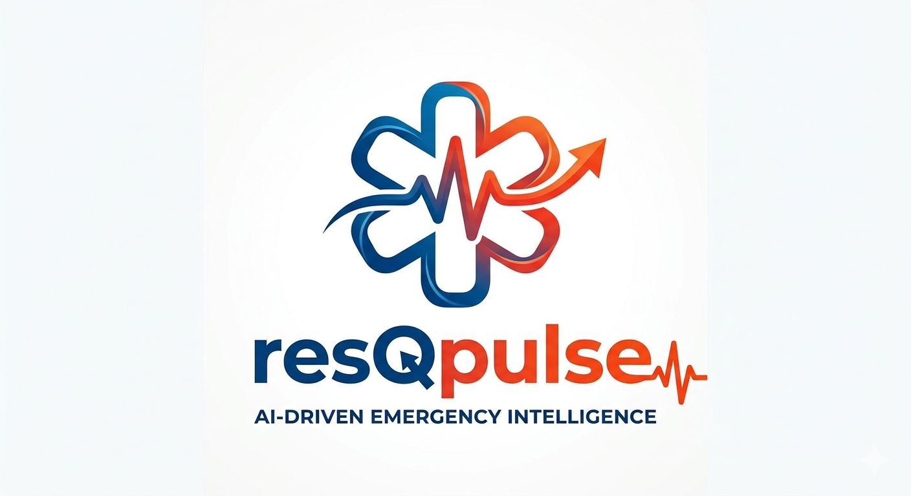

<p align="center">
  
</p>

ResQPulse is a real-time emergency response system that connects **users, ambulances, and hospitals** on a unified platform. It enables instant SOS alerts, live ambulance coordination, and real-time hospital availability tracking using a scalable MERN architecture.

---

## 🌟 Features

- 🚨 One-tap SOS emergency request
- 🚑 Real-time ambulance dispatch & tracking
- 🏥 Live hospital availability (beds, ICU, etc.)
- 🔄 Seamless communication between all three interfaces:
  - User
  - Ambulance
  - Hospital
- 🌐 Centralized MongoDB Atlas database for shared live data
- ⚡ Socket.IO for real-time updates

---

## 🛠 Tech Stack

- **Frontend:** React
- **Backend:** Node.js, Express
- **Database:** MongoDB Atlas
- **Real-time:** Socket.IO

---

## ⚙️ Setup Instructions

### 1. Clone the repository

```bash
git clone https://github.com/YOUR_USERNAME/resqpulse.git
cd resqpulse
